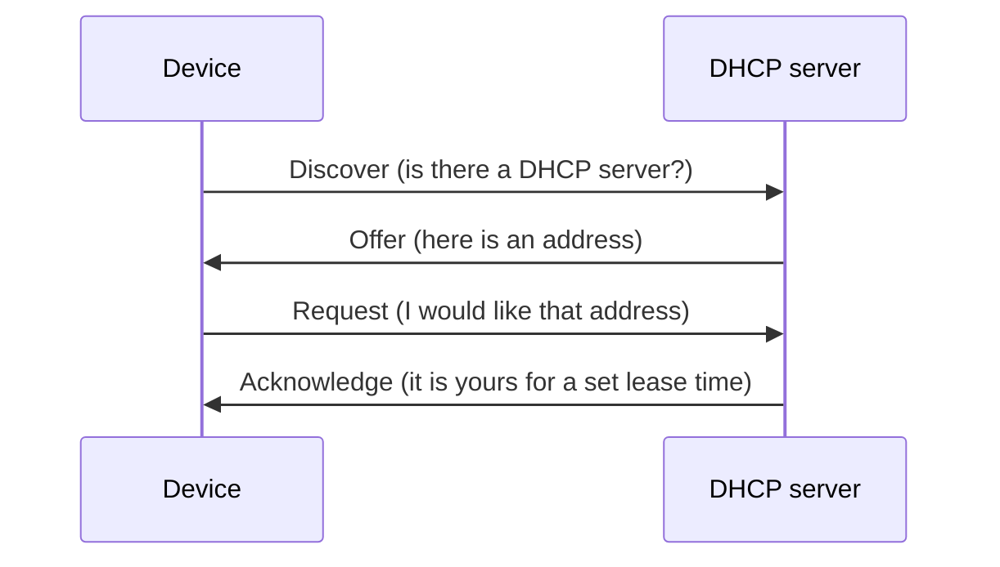

# Network Basics Notes

Plain-language notes on three protocols every IT support role relies on: TCP/IP, DHCP and DNS. I wrote these to reinforce my learning and as a quick reference for troubleshooting.

## 1. The TCP/IP model
| Layer | Job | Examples |
|---|---|---|
| Application | Programs talk to the network | HTTP, HTTPS, DNS, DHCP |
| Transport | Delivers data between programs | TCP (reliable), UDP (fast) |
| Internet | Addresses and routes packets | IP, ICMP (ping) |
| Link | Moves bits over the physical medium | Ethernet, Wi-Fi |

## 2. DHCP: getting an IP address automatically
When a device joins a network, it asks a DHCP server for an address in four steps, often called DORA.

The device also receives the subnet mask, default gateway and DNS server address.

## 3. DNS: turning names into addresses
DNS works like a phone book. When you type a website name, your device asks a resolver, which asks other servers until it finds the address.

## 4. Basic troubleshooting checklist
Work from the bottom layer upwards.

1. **Physical:** Is the cable connected and are the link lights on?
2. **Address:** Does the device have a valid IP? (`ipconfig` on Windows, `ip a` on Linux)
3. **Local network:** Can it reach the gateway? (`ping` the gateway address)
4. **Internet:** Can it reach an outside address? (`ping 8.8.8.8`)
5. **DNS:** Can it resolve names? (`nslookup example.com`)

If step 4 works but step 5 fails, the problem is DNS, not the connection.

## Useful commands
| Task | Windows | Linux |
|---|---|---|
| Show IP settings | `ipconfig /all` | `ip a` |
| Renew DHCP lease | `ipconfig /renew` | `sudo dhclient -r && sudo dhclient` |
| Test connection | `ping` | `ping` |
| Look up a name | `nslookup` | `nslookup` or `dig` |
| Trace the route | `tracert` | `traceroute` |
